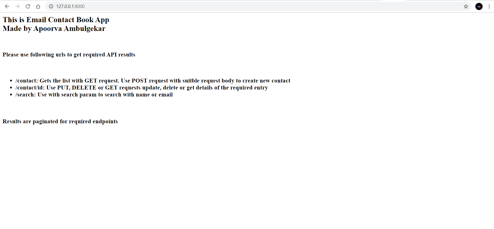
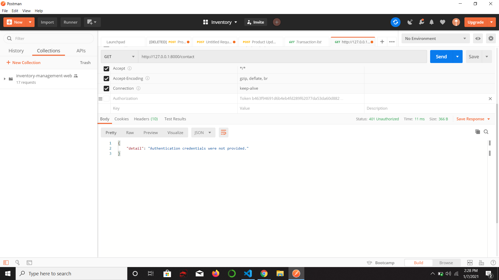
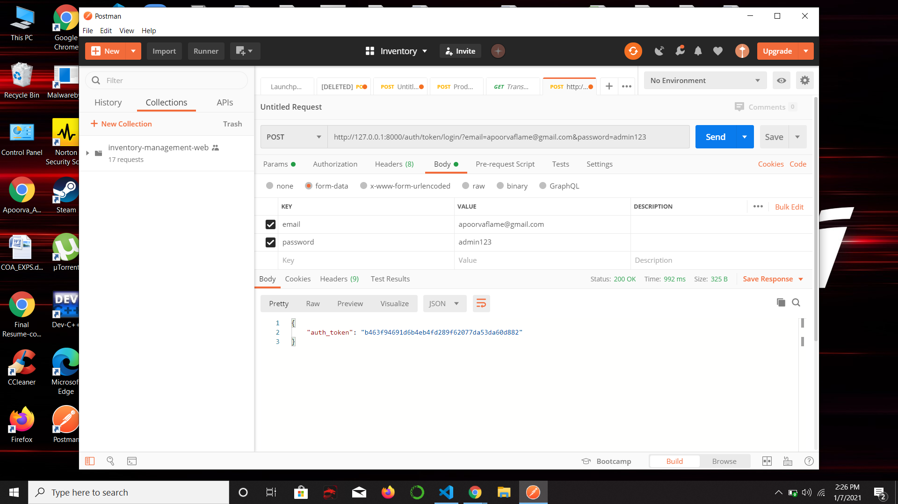
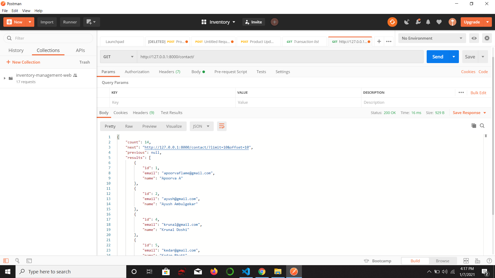
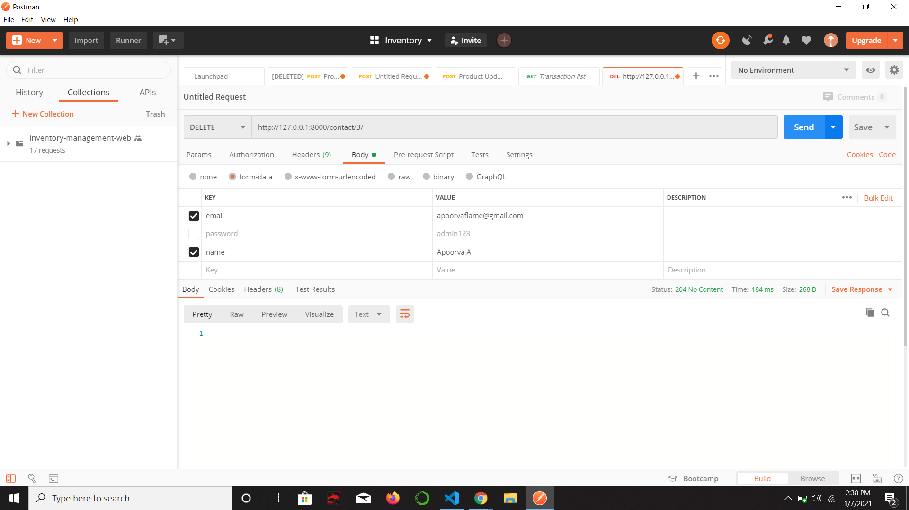
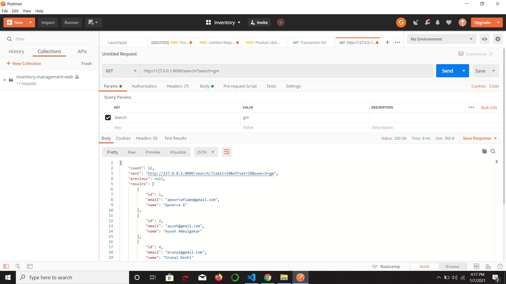

# Morr-Technologies-Assignment

## This is an Email Contact Book App made by me. It uses Django REST framework for the backend and uses Djoser to enable token authentication.
## Following are the screenshots of the output on Postman.

### Required Endpoints are paginated.

* Index

* Authentication Required

* Login and aquire token

* Contact list

* Contact Detail

* Create Contact

* Update Contact

* Delete Contact

* Contact Search

